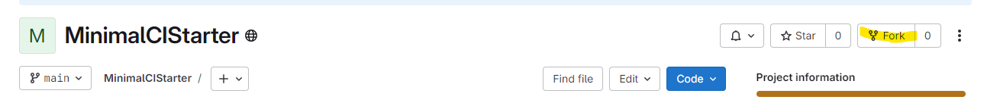
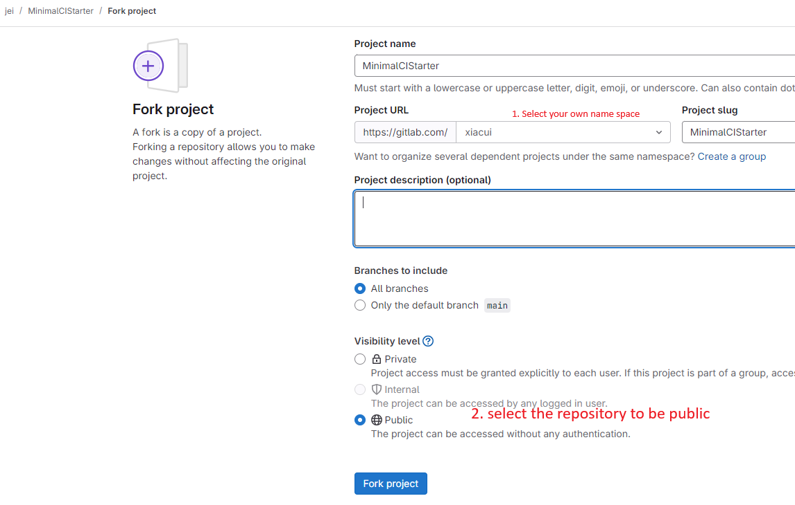
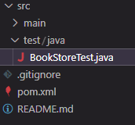
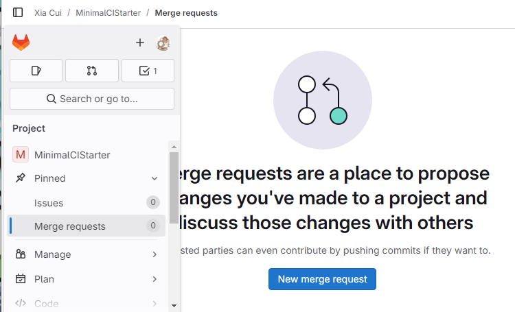
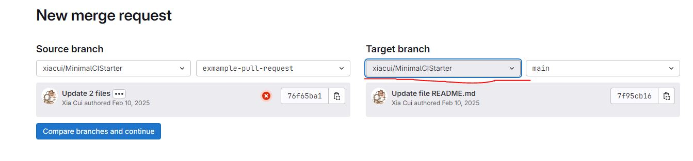
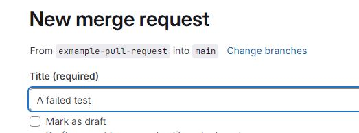
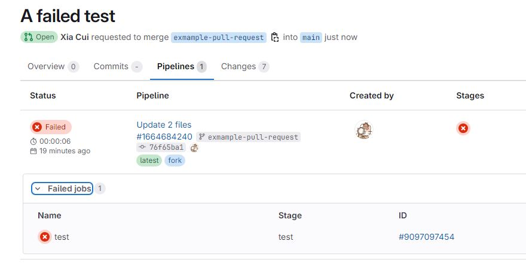

# README

Get started by logging into your GitLab account and clicking `fork` to create your own version of this repository. 



Create your new repository as is shown below.



Then, follow the instructions below to set-up CI for this repository.

## Step 1

Add the following your `pom.xml` file:

```
<build>
  <plugins>
    <plugin>
      <groupId>org.apache.maven.plugins</groupId>
      <artifactId>maven-surefire-plugin</artifactId>
      <version>2.22.2</version>
    </plugin>
  </plugins>
</build>
```
Afterwards, your `pom.xml` file should look like this:

```
<?xml version="1.0" encoding="UTF-8"?>
<project xmlns="http://maven.apache.org/POM/4.0.0"
         xmlns:xsi="http://www.w3.org/2001/XMLSchema-instance"
         xsi:schemaLocation="http://maven.apache.org/POM/4.0.0 http://maven.apache.org/xsd/maven-4.0.0.xsd">
    <modelVersion>4.0.0</modelVersion>

    <groupId>org.example</groupId>
    <artifactId>MinimalCIStarter</artifactId>
    <version>1.0-SNAPSHOT</version>

    <properties>
        <maven.compiler.source>22</maven.compiler.source>
        <maven.compiler.target>22</maven.compiler.target>
        <project.build.sourceEncoding>UTF-8</project.build.sourceEncoding>
    </properties>
    
    <dependencies>
        <dependency>
            <groupId>org.junit.jupiter</groupId>
            <artifactId>junit-jupiter</artifactId>
            <version>5.8.1</version>
            <scope>test</scope>
        </dependency>
    </dependencies>

    <build>
        <plugins>
            <plugin>
                <groupId>org.apache.maven.plugins</groupId>
                <artifactId>maven-surefire-plugin</artifactId>
                <version>2.22.2</version>
            </plugin>
        </plugins>
    </build>
</project>
```

🧠 **Explanation (why are we doing this):** This code configures the Maven Surefire Plugin, which is used during the test phase of the build lifecycle to execute the unit tests of an application. It integrates well with continuous integration pipelines, as we will (hopefully) see very soon!

## Step 2

Create a new file named `.gitlab-ci.yml` in the root/master folder, or you can create it by click on the right of the directory.


After you've created the folder and returned to `gitlab.com/your_user_name/MinimalCIStarter` your repository should look a bit like this:


🧠 **Explanation (why are we doing this):** The `.gitlab-ci.yml` is used to store configuration files specific to GitLab. Many templates could be found for different programming languages. These files define the automated processes that GitLab Actions will run as a part of our CI pipeline. The workflow is defined in a separate YAML file and can include steps for building, testing, and deploying your code, among other tasks.

## Step 3

Inside your `.gitlab-ci.yml` file. Add the following contents to the file (again, you might like to use web IDE to do this):

```
stages:
  - test

test:
  stage: test
  image: maven:3.8.6-openjdk-22
  before_script:
    - echo "Setting up environment"
  script:
    - mvn test
  only:
    - branches
```

After you have done this, be sure to commit and push your changes.


🧠 **Explanation (why are we doing this):** In this crucial step we have defined a workflow that will run as a part of our CI pipeline. In the workflow we make use of some existing actions to checkout the code and set-up the relevant JDK (i.e., `maven:3.8.6` and `openjdk-22`) before running our tests with `script: mvn test`.

## Step 4

To better understand the value of CI you could now create a merge request to see it in action. There are many ways you could do this, but using the web IDE interface as detailed below is one option.

To begin creating a merge request, you should first create a new branch. Do this by clicking the name of your current branch (i.e., main); It should be visible towards the bottom left corner of your the web IDE, like this:


After clicking the button, a pop-up will appear. When it does, select the `Create new branch...` option and enter a name for your branch when prompted. Press `Enter` to save it. 

Click the `main` repo and change it to the newly created branch. After doing this, you should notice that your current branch has changed, with a different branch name being visible towards the bottom left corner, like this:


Now that you're on a new branch, make some changes to the code to better understand the value of CI. To do this, navigate to the following file using the Sidebar: `src/test/java/BookStoreTest.java`:



After opening this file, scroll down to the end of it and you should notice a test that has been commented out, like this:

```java
/* @Test
void aFailingTest() {
  fail();
} */
```

Uncomment this test (which is clearly designed to fail), like this:

```java
@Test
void aFailingTest() {
  fail();
} 
```

Now commit and push your changes.

Navigate back to `gitlab.com` and on the left sidebar you can find `merge requests`, there is no merge requests currently but you can create one yourself. Click the blue `New merge request` button. 



Eventually, you should see that the tests are run automatically, and that the failing test causes the check to fail, like this (a red cross on the left repo):



Make sure you select `your_user_name/MinimalCIStarter` and `main`. Then. click the blue `Compare branches and continue`. It pops up new merge request like this:



Name the title as `a failed test`, next, click the blue `create merge request` button at the bottom. Then you should see a new merge request like this:



🧠 **Explanation (why are we doing this):** We completed setting-up our workflow/CI pipeline in the previous step. Here, we have gone through the process of raising a merge request that includes a deliberately failing test to demonstrate the value of CI. Notice how the failing test is automatically and clearly flagged before the changes are merged into the main/production branch.

## 🥇 Step 5

 Well done. You have have now completed this learning activity. Be sure to ask the facilitator if anything was unclear (a fully worked example is available: (https://gitlab.com/xiacui/MinimalCIStarter).


